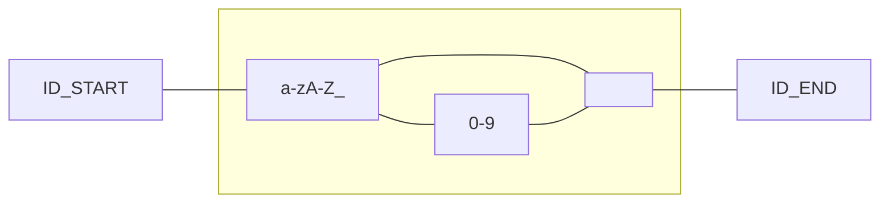
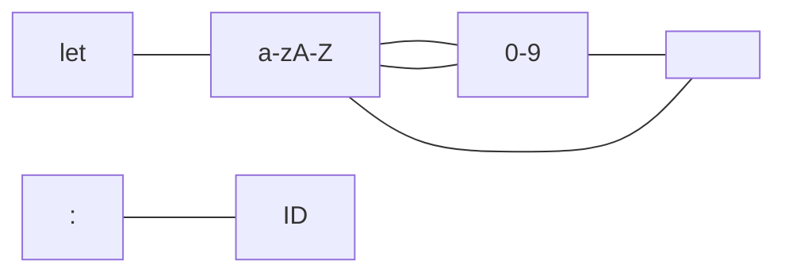
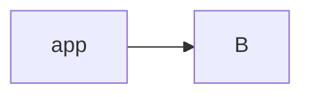

# Le Pol

## Introduction

## Docs

### Identifiant 

```mermaid
graph LR;
    ID_START --- char
    subgraph _[ ]
        char[a-zA-Z_] --- link[ ]
        char[a-zA-Z_] --- digit
        digit[0-9] --- link
    end

    link --- ID_END

```
### Variables 

```mermaid
graph LR;
    let---char[a-zA-Z]
    digit[0-9]---char
    char---digit

    digit --- opt_type
    char --- opt_type

    opt_type[ ]

    colon[:] --- ID
```

### Définition de fonction

```mermaid
graph LR;
    app-->B
```